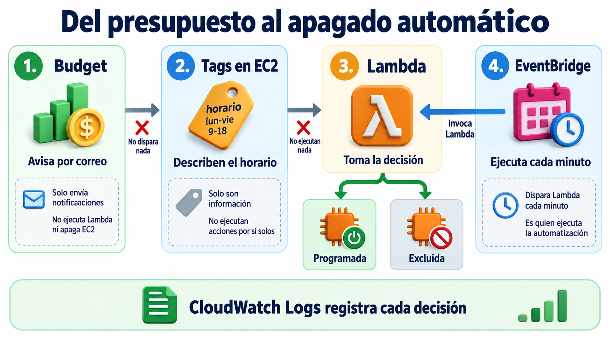
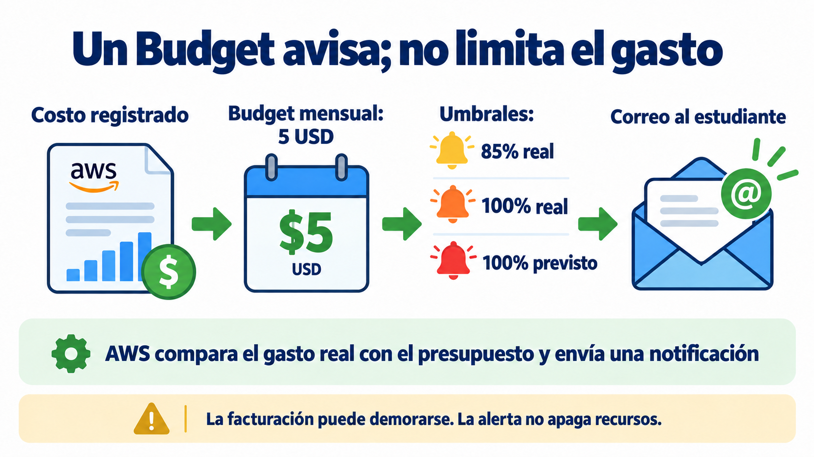
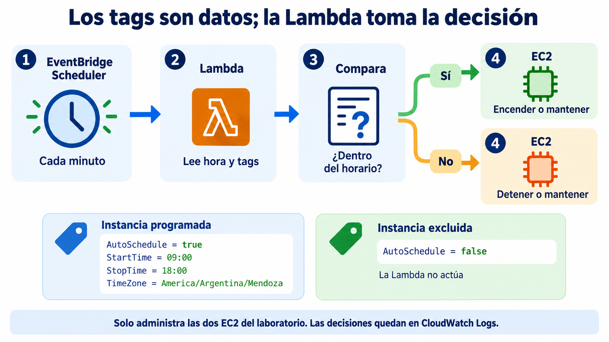

# Módulo 5 · Clase 1 — Control de costos desde la consola de AWS

En este laboratorio vas a crear un presupuesto mensual de **5 USD**, etiquetar dos instancias EC2 y automatizar el encendido y apagado de una de ellas. Todo se hace desde la **consola de AWS**. No necesitás CloudShell, Terraform, AWS CLI ni conectarte por SSH.

**Duración:** 80 a 90 minutos. Usamos la región **N. Virginia (`us-east-1`)** y la VPC default de la cuenta.



## Qué vamos a construir

- Un **AWS Budget** mensual de 5 USD para toda la cuenta.
- Dos EC2 `t3.micro` con Amazon Linux y discos gp3 de 8 GiB:
  - `m5-clase1-scheduled`, administrada por horario.
  - `m5-clase1-excluded`, visible para la función pero excluida de sus acciones.
- Una función **AWS Lambda** escrita en Python.
- Un **EventBridge Scheduler** que invoca la función cada minuto.
- Registros en **CloudWatch Logs** para ver cada decisión.

Usaremos la **VPC default**, una subnet default y el security group default. Las instancias no tendrán IP pública, reglas de entrada ni key pair. No alojan una aplicación: solo observamos sus estados desde AWS.

> Este laboratorio crea recursos con costo. Un Budget avisa, pero no bloquea ni detiene el gasto. Al terminar hay que completar la limpieza.

## 1. Crear un Budget de 5 USD



### Antes de hacer clic

**AWS Budgets** compara los cargos que AWS ya registró con un importe definido. El valor **real** mira lo consumido hasta ahora; el valor **previsto** estima cómo podría cerrar el mes si continúa la tendencia. Los datos de facturación pueden llegar con demora.

El Budget abarca **todos los servicios de la cuenta**. Los tags de distribución de costos requieren activación y tiempo de propagación, por lo que no sirven para una demostración inmediata.

### Paso a paso

1. En el buscador superior de AWS escribí **Billing and Cost Management** y abrí el servicio.
2. En el menú izquierdo entrá en **Budgets**.
3. Elegí **Create budget**.
4. Seleccioná **Use a template (simplified)**.
5. Elegí la plantilla **Monthly cost budget**.
6. En **Budget name** escribí `m5-clase1-5-usd`.
7. En **Enter your budgeted amount ($)** escribí `5`.
8. En **Email recipients** ingresá un correo al que tengas acceso.
9. Revisá el resumen y elegí **Create budget**.

La plantilla crea tres avisos:

- gasto real al llegar al **85%**;
- gasto real al llegar al **100%**;
- gasto previsto al llegar al **100%**.

**Qué observar:** el Budget queda en la lista y su alcance dice todos los servicios. No esperamos que llegue un correo durante la clase: crear el Budget no genera gasto y los datos de facturación no son instantáneos.

## 2. Crear la EC2 programada

### Qué significan las opciones que vamos a tocar

| Recurso u opción | Qué es | Por qué elegimos este valor |
|---|---|---|
| **AMI** | Imagen que contiene el sistema operativo inicial. | Amazon Linux 2023 es una imagen mantenida por AWS. |
| **Instance type** | Combinación de CPU, memoria, red y precio. | `t3.micro` alcanza para observar estados sin ejecutar carga. |
| **Key pair** | Credencial para iniciar sesión por SSH. | No la necesitamos porque no entraremos a la máquina. |
| **VPC** | Red virtual privada de la cuenta. | Reutilizamos la VPC default para evitar red ajena al tema. |
| **Subnet** | Segmento de una VPC y de una zona de disponibilidad. | AWS elige una subnet default disponible. |
| **Public IP** | Dirección accesible desde Internet. | La desactivamos porque no habrá conexiones entrantes. |
| **Security group** | Firewall con estado asociado a la interfaz de red. | Usamos el default y no agregamos reglas de entrada. |
| **EBS gp3** | Disco persistente conectado a EC2. | 8 GiB alcanza; sigue generando costo aunque EC2 esté detenida. |

### Paso a paso

1. Cambiá la región superior derecha a **N. Virginia (`us-east-1`)**.
2. Abrí **EC2 → Instances → Launch instances**.
3. En **Name** escribí `m5-clase1-scheduled`.
4. En **Application and OS Images**, dejá **Amazon Linux 2023**.
5. En **Instance type**, elegí `t3.micro`.
6. En **Key pair**, elegí **Proceed without a key pair**.
7. En **Network settings**, elegí **Edit** y configurá:
   - VPC: la que figure como **default**.
   - Subnet: **No preference**.
   - Auto-assign public IP: **Disable**.
   - Firewall: **Select existing security group**.
   - Security group: el que se llame **default**.
8. En **Configure storage**, dejá un volumen raíz de **8 GiB, gp3**.
9. En **Name and tags**, elegí **Add additional tags**.
10. Agregá estos tags al recurso **Instances**:

| Key | Value |
|---|---|
| `Name` | `m5-clase1-scheduled` |
| `Project` | `m5-clase1` |
| `Owner` | `formatec` |
| `CostCenter` | `capacitacion` |
| `AutoSchedule` | `true` |
| `StartTime` | `00:00` |
| `StopTime` | `23:59` |
| `ActiveDays` | `mon,tue,wed,thu,fri,sat,sun` |
| `TimeZone` | `America/Argentina/Mendoza` |

11. Revisá el resumen y elegí **Launch instance**.
12. Volvé a **Instances** y esperá hasta verla en estado **Running**.

Un tag es un par `clave=valor`. AWS no interpreta por sí solo `StartTime` ni `AutoSchedule`: son datos que nuestro código decidió entender. `Name` también es un tag; el identificador real de la instancia sigue siendo `i-...`.

## 3. Crear una EC2 excluida

Repetí la creación anterior con la misma AMI, tamaño, red y disco. Agregá solamente estos tags:

| Key | Value |
|---|---|
| `Name` | `m5-clase1-excluded` |
| `Project` | `m5-clase1` |
| `Owner` | `formatec` |
| `CostCenter` | `capacitacion` |
| `AutoSchedule` | `false` |

No hacen falta `StartTime`, `StopTime`, `ActiveDays` ni `TimeZone`: `AutoSchedule=false` hace que la Lambda la omita antes de leer el horario.

**Qué observar:** ambas EC2 están encendidas y comparten `Project=m5-clase1`, pero solo una participa de la automatización. Esta comparación vuelve visible el efecto del tag.

## 4. Entender la automatización



**Lambda** ejecuta código cuando recibe un evento. AWS administra los servidores donde corre; nosotros elegimos runtime, código, permisos y configuración. En este laboratorio la función dura segundos y no queda ejecutándose entre invocaciones.

**EventBridge Scheduler** conserva una agenda y, al cumplirse, envía un evento al destino. Será el reloj que invoca Lambda cada minuto. Scheduler no sabe qué EC2 debe apagar: solo llama a la función.

La función hace una **reconciliación**:

1. busca EC2 con `Project=m5-clase1`;
2. descarta las que no tienen `AutoSchedule=true`;
3. convierte la hora actual a la zona indicada;
4. calcula si cada instancia debería estar `running` o `stopped`;
5. actúa solamente cuando el estado real es distinto del deseado.

Si una EC2 ya está detenida, no vuelve a llamar a `StopInstances`. Esto hace que la ejecución repetida sea segura e idempotente.

## 5. Crear la función Lambda

1. Abrí **Lambda → Functions → Create function**.
2. Elegí **Author from scratch**.
3. En **Function name** escribí `m5-clase1-ec2-scheduler`.
4. En **Runtime**, elegí **Python 3.14**.
5. En **Architecture**, dejá `x86_64`.
6. Dejando seleccionada la creación de un rol básico, elegí **Create function**.

El **execution role** es la identidad IAM que adopta la función al ejecutarse. El rol básico creado por la consola puede escribir logs, pero todavía no puede leer ni cambiar EC2.

### Pegar el código

1. En **Code source**, abrí `lambda_function.py`.
2. Reemplazá todo el contenido por el siguiente código.
3. Elegí **Deploy**.

```python
"""Enciende o detiene las EC2 del laboratorio según sus tags de horario."""
import json
import re
from datetime import datetime, timedelta, timezone
from zoneinfo import ZoneInfo, ZoneInfoNotFoundError

PROJECT = "m5-clase1"
DAYS = {name: index for index, name in enumerate(
        ("mon", "tue", "wed", "thu", "fri", "sat", "sun"))}


def desired_state(tags, now):
    if tags.get("AutoSchedule") != "true":
        return None, "excluded"

    try:
        start = tags["StartTime"]
        stop = tags["StopTime"]
        if not all(re.fullmatch(r"([01]\d|2[0-3]):[0-5]\d", value)
                   for value in (start, stop)):
            raise ValueError("horario invalido")
        if start == stop:
            raise ValueError("inicio y fin iguales")

        names = tags["ActiveDays"].split(",")
        days = {DAYS[name] for name in names}
        local = now.astimezone(ZoneInfo(tags["TimeZone"]))
        minute = local.strftime("%H:%M")

        if start < stop:
            active = local.weekday() in days and start <= minute < stop
        else:
            active = ((local.weekday() in days and minute >= start) or
                      ((local - timedelta(days=1)).weekday() in days and
                       minute < stop))
        return ("running" if active else "stopped"), "schedule"
    except (KeyError, ValueError, ZoneInfoNotFoundError) as error:
        return None, f"invalid_tags: {error}"


def reconcile(ec2, now, dry_run):
    results = []
    failures = []
    pages = ec2.get_paginator("describe_instances").paginate(Filters=[
        {"Name": "tag:Project", "Values": [PROJECT]},
        {"Name": "instance-state-name",
         "Values": ["pending", "running", "stopping", "stopped"]},
    ])

    for page in pages:
        for reservation in page["Reservations"]:
            for instance in reservation["Instances"]:
                tags = {tag["Key"]: tag["Value"]
                        for tag in instance.get("Tags", [])}
                desired, reason = desired_state(tags, now)
                state = instance["State"]["Name"]
                result = {
                    "instance_id": instance["InstanceId"],
                    "name": tags.get("Name", "sin-Name"),
                    "state": state,
                    "desired": desired,
                    "reason": reason,
                    "dry_run": dry_run,
                    "action": "none",
                }

                if desired and state in ("running", "stopped") and state != desired:
                    action = "start" if desired == "running" else "stop"
                    result["action"] = action
                    if not dry_run:
                        try:
                            getattr(ec2, f"{action}_instances")(
                                InstanceIds=[instance["InstanceId"]])
                        except Exception as error:
                            result["error"] = str(error)
                            failures.append(instance["InstanceId"])
                elif state in ("pending", "stopping"):
                    result["reason"] = "transition_in_progress"

                print(json.dumps(result, ensure_ascii=False))
                results.append(result)

    if failures:
        raise RuntimeError(f"EC2 actions failed: {failures}")
    return results


def lambda_handler(event, context):
    import boto3

    dry_run = event.get("dry_run", True)
    if not isinstance(dry_run, bool):
        raise ValueError("dry_run debe ser true o false, sin comillas")

    return {"results": reconcile(
        boto3.client("ec2"), datetime.now(timezone.utc), dry_run
    )}
```

El mismo código está en [`lambda/scheduler.py`](lambda/scheduler.py).

### Dar acceso controlado a EC2

1. Dentro de la función abrí **Configuration → Permissions**.
2. Elegí el nombre que aparece en **Execution role**. Se abrirá IAM.
3. En el rol elegí **Add permissions → Create inline policy**.
4. Abrí la pestaña **JSON**, reemplazá el contenido y pegá:

```json
{
  "Version": "2012-10-17",
  "Statement": [
    {
      "Sid": "DiscoverLabInstances",
      "Effect": "Allow",
      "Action": "ec2:DescribeInstances",
      "Resource": "*"
    },
    {
      "Sid": "ControlOnlyScheduledLabInstances",
      "Effect": "Allow",
      "Action": ["ec2:StartInstances", "ec2:StopInstances"],
      "Resource": "arn:aws:ec2:*:*:instance/*",
      "Condition": {
        "StringEquals": {
          "ec2:ResourceTag/Project": "m5-clase1",
          "ec2:ResourceTag/AutoSchedule": "true"
        }
      }
    }
  ]
}
```

5. Elegí **Next**.
6. Nombrá la política `m5-clase1-control-ec2` y elegí **Create policy**.

`DescribeInstances` necesita `Resource: "*"` porque esa API no admite restringirse a ARN de instancia. En cambio, Start y Stop quedan condicionadas por tags. Aunque un error de código intentara actuar sobre la instancia excluida, IAM lo denegaría.

## 6. Probar primero sin cambiar estados

1. Volvé a la función Lambda y abrí **Test**.
2. Creá un evento llamado `preview` con este contenido:

```json
{"dry_run": true}
```

3. Elegí **Test**.

`dry_run=true` ejecuta la lectura y la decisión, pero no llama a Start ni Stop. En la respuesta esperá dos resultados:

- `m5-clase1-scheduled`: `reason` vale `schedule` y `desired` muestra el estado calculado.
- `m5-clase1-excluded`: `reason` vale `excluded`, `desired` es `null` y `action` es `none`.

Si aparece `AccessDenied`, revisá que la política esté adjunta al execution role correcto. Si falta una instancia, comprobá `Project=m5-clase1` y la región.

## 7. Demostrar apagado y encendido

### Forzar una ventana cerrada

1. Abrí **EC2 → Instances** y seleccioná `m5-clase1-scheduled`.
2. Elegí **Tags → Manage tags**.
3. Cambiá `StartTime` y `StopTime` por una ventana corta que **no incluya la hora actual de Mendoza**. Por ejemplo, `00:00` a `00:01`, excepto si justo estás en ese minuto.
4. Guardá los tags.
5. En Lambda, cambiá el evento de prueba a `{"dry_run": false}`.
6. Elegí **Test** y volvé a EC2.

**Resultado esperado:** `scheduled` pasa por `Stopping` hasta `Stopped`; `excluded` sigue `Running`. En la respuesta de Lambda aparece `action: stop` solo para la programada.

### Volver a abrir la ventana

1. Cambiá los tags para que la ventana incluya la hora actual de Mendoza. Elegí un inicio una hora antes y un final una hora después. El código admite una ventana que cruza medianoche, por ejemplo `23:00` a `01:00`.
2. Ejecutá otra vez el evento con `dry_run=false`.

**Resultado esperado:** `scheduled` pasa por `Pending` hasta `Running`. Una ejecución posterior devuelve `action: none` porque el estado ya coincide con lo deseado.

## 8. Automatizar con EventBridge Scheduler

1. En la página de la función, dentro de **Function overview**, elegí **Add trigger**.
2. Seleccioná **EventBridge Scheduler**.
3. Elegí **Create a new schedule**.
4. En **Schedule name** escribí `m5-clase1-every-minute`.
5. Dejá el grupo `default`.
6. Elegí un horario recurrente de tipo **rate** y escribí `rate(1 minute)`.
7. Como entrada del evento pegá `{"dry_run": false}`.
8. Permití que Scheduler cree un rol nuevo para invocar la función y completá **Add** o **Create schedule**.

El rol de Scheduler y el execution role de Lambda cumplen funciones distintas:

- **Scheduler role:** permite que EventBridge invoque esta Lambda.
- **Lambda execution role:** permite que el código escriba logs y opere EC2.

Scheduler entrega la invocación de forma asíncrona y su precisión es del orden de un minuto. Para verificarlo, cerrá la ventana mediante tags y esperá entre uno y dos minutos sin usar el botón Test. La programada debería detenerse sola. Volvé a abrir la ventana y observá el arranque automático. [Scheduler como trigger de Lambda](https://docs.aws.amazon.com/lambda/latest/dg/with-eventbridge-scheduler.html).

## 9. Leer las decisiones en CloudWatch Logs

1. En Lambda abrí **Monitor**.
2. Elegí **View CloudWatch logs**.
3. Abrí el log stream más reciente.

Un **log group** reúne los registros de una función; cada **log stream** corresponde a una secuencia de ejecuciones de un entorno de Lambda. Nuestra función imprime un JSON por instancia con estado real, estado deseado, motivo y acción.

| Campo | Interpretación |
|---|---|
| `dry_run: true` | Calculó, pero no cambió EC2. |
| `action: stop` | Solicitó detener la programada. |
| `action: start` | Solicitó iniciarla. |
| `action: none` | Ya coincidía o estaba excluida. |
| `reason: transition_in_progress` | EC2 estaba cambiando y se esperó otra vuelta. |
| `reason: invalid_tags` | Un tag era inválido; se omitió por seguridad. |

[Cómo ver logs de Lambda](https://docs.aws.amazon.com/lambda/latest/dg/monitoring-cloudwatchlogs-view.html).

## 10. Limpieza obligatoria

Hacé la limpieza en este orden:

1. **EventBridge Scheduler → Schedules:** eliminá `m5-clase1-every-minute`.
2. **Lambda → Functions:** eliminá `m5-clase1-ec2-scheduler`.
3. **IAM → Roles:** eliminá el rol creado para Scheduler y el execution role creado para Lambda.
4. **CloudWatch → Log groups:** eliminá `/aws/lambda/m5-clase1-ec2-scheduler`.
5. **EC2 → Instances:** seleccioná ambas y elegí **Instance state → Terminate instance**.
6. **Billing and Cost Management → Budgets:** eliminá `m5-clase1-5-usd`.

No elimines la VPC, subnet ni security group default: existían antes del laboratorio y otros recursos podrían necesitarlos. Una EC2 detenida conserva su volumen EBS y puede seguir generando cargos; para cerrar el laboratorio debe quedar **Terminated**.

## Mapa mental para explicar la clase

| Si preguntan… | Respuesta corta |
|---|---|
| ¿El Budget apaga la EC2? | No. Observa costo y envía alertas. |
| ¿El tag ejecuta algo? | No. Es información que Lambda interpreta. |
| ¿Quién inicia la automatización? | EventBridge Scheduler invoca Lambda cada minuto. |
| ¿Quién decide? | Lambda compara hora, tags y estado actual. |
| ¿Quién autoriza? | IAM limita lo que la función puede leer y cambiar. |
| ¿Dónde veo qué pasó? | En Lambda, EC2 y CloudWatch Logs. |
| ¿Por qué una EC2 queda encendida? | Tiene `AutoSchedule=false`; sirve como caso de control. |
| ¿Por qué usamos la VPC default? | La red no es el objeto del laboratorio y no recibe tráfico. |

## Material del repositorio

- [`lambda/scheduler.py`](lambda/scheduler.py): código para pegar en Lambda.
- [`policies/lambda-ec2-scheduler.json`](policies/lambda-ec2-scheduler.json): política del execution role.
- [`events/preview.json`](events/preview.json) y [`events/apply.json`](events/apply.json): eventos de prueba.

El código incluye pruebas automatizadas para ventanas diurnas y nocturnas, zona horaria, exclusión, vista previa, idempotencia y errores de permisos. El laboratorio fue contrastado con la consola actual de AWS en `us-east-1`.
